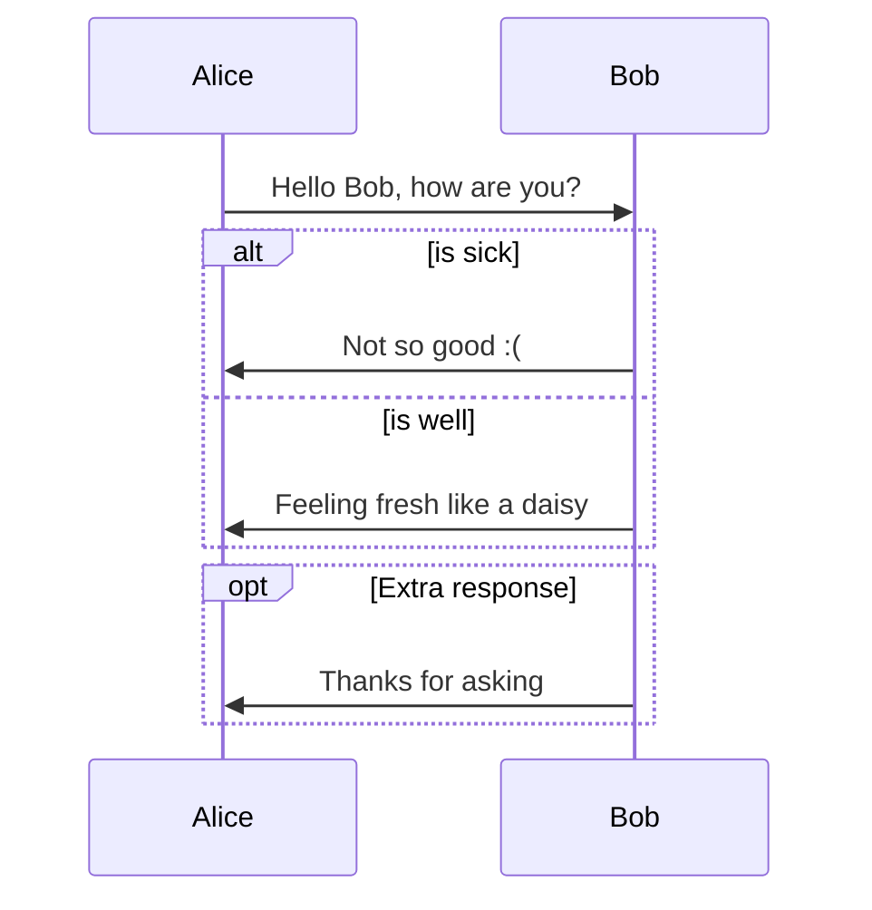
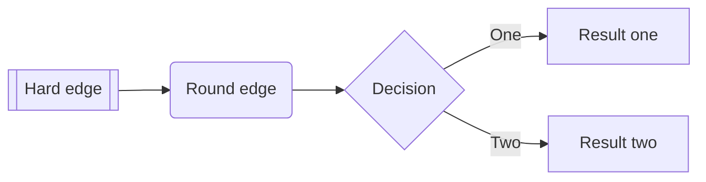
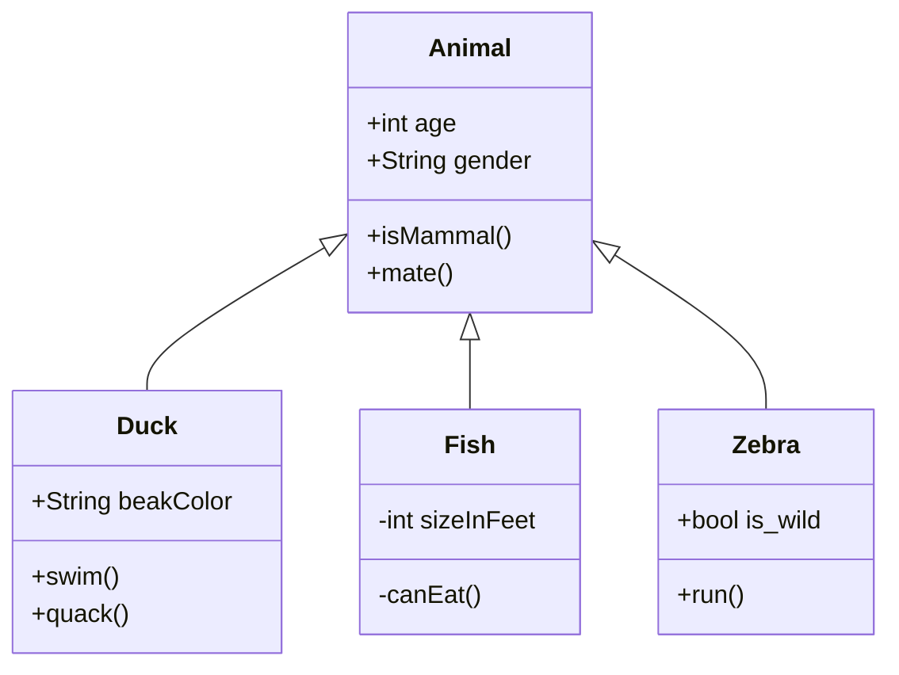
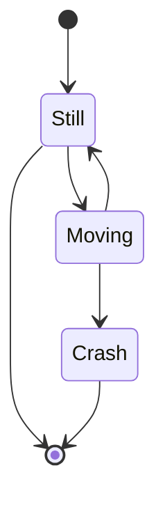
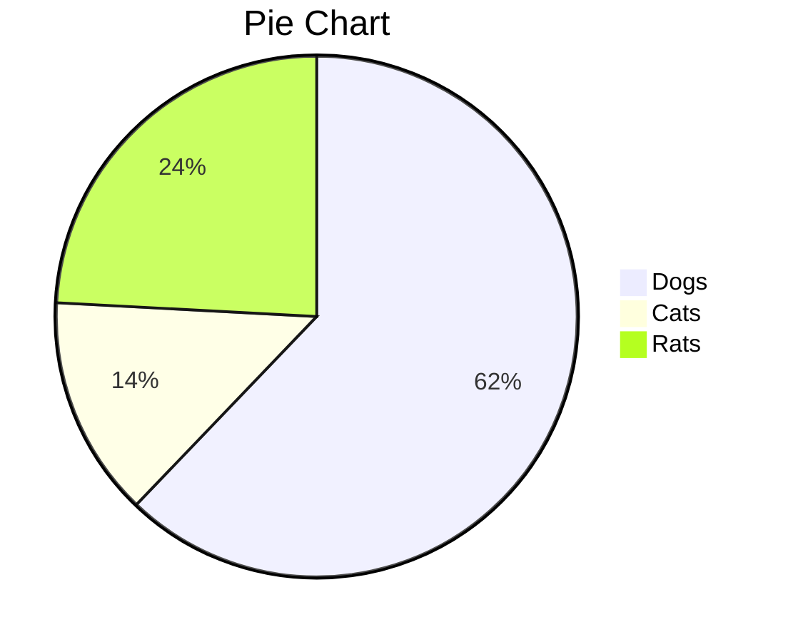
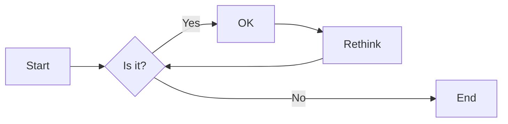
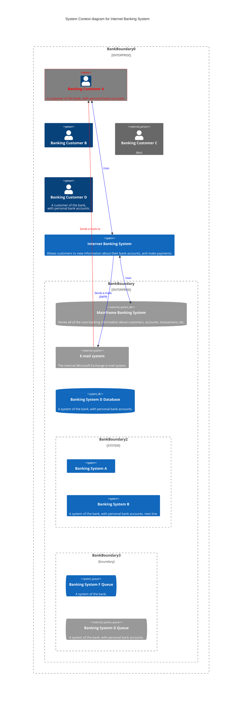
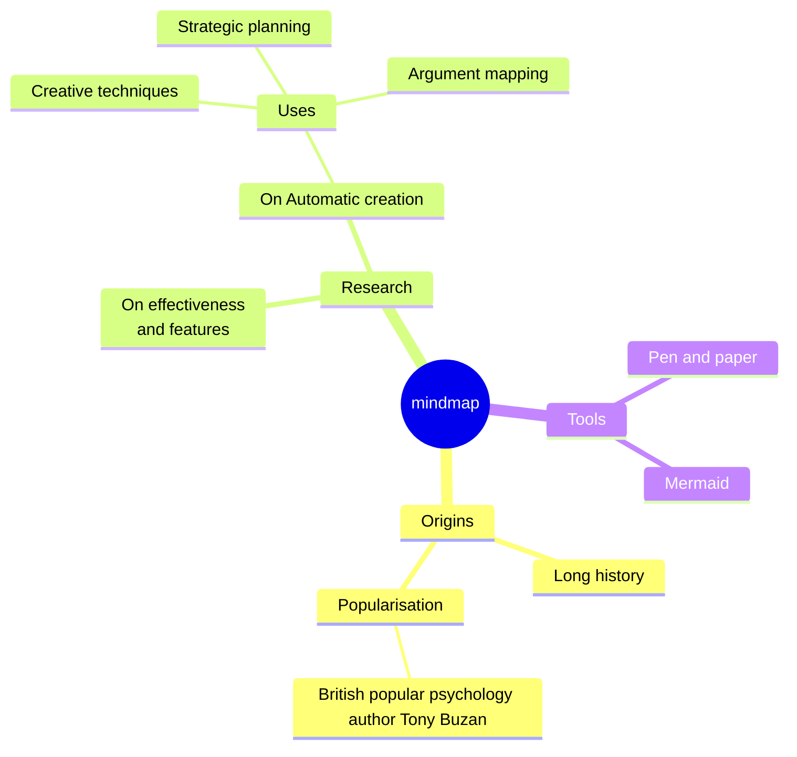
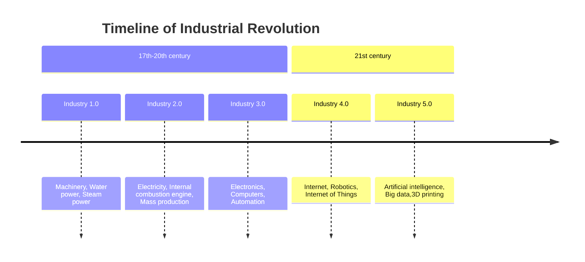

\[toc] 插入目录（自动更新）

[toc]

# # Markdown Latex

1-6 # -> ######

## 段落与换行

`Enter` 新段落 、退出一个块级<br/>`Shift Enter` 换行 或者行尾加`'  <br/>'` 或者 `'\'`

`BackSpace` 清除这个块级的标志样式

## 块

>  \> Block 1
>
> > \>Block 2


## 列表

* \* 无序列表
1. 有序列表
2. 有序列表

## 任务列表

- [ ] \- \[ ] 未完成的任务

- [x] \- \[x] 已完成的任务


## 代码块

```python
```python 回车后即可进入代码块 ```
def function(a,b):
    return a+b
```

$$
$$ 回车后进入LaTex数学表达式
$$

| first header | second header | third header |
| ------------ | :-----------: | -----------: |
| left-aligned | align center  | right-aligned|

You can create footnotes like this[^1].

[^1]: Here is the *text* of the **footnote** 1
[^footnote]: 

***

\*** 创建一条上面的水平分割线

## 链接

- 外部链接

  Click [here](http://www.baidu.com "百度") to open baidu.

- 内部链接

  Hold down Ctrl and click [here](#链接) to jump to head 链接.

- 参考链接

  This is [an example][id] reference-style link.

  [id]: http://example.com/  "Optional Title Here"

- <www.google.com>

## 图片

- 复制粘贴，自动在目录下生成`标题.assets`文件夹
- 

## 文字样式

- *单\*强调*  _单\_强调_

- **双\*\*加粗**

- `行内代码`

- ~~删除线~~

- 输入冒号:选择表情符号

  :slightly_smiling_face: :artificial_satellite:

- 上^标^ 下~标~  需要设置中开启然后重启软件

## HTML

- <font style="color:red">HTML标签红色</font>

- <u>下划线</u>

- 嵌入iframe内容

  <iframe height='265' scrolling='no' title='Fancy Animated SVG Menu' src='http://www.example.com' frameborder='no' allowtransparency='true' allowfullscreen='true' style='width: 100%;'></iframe>

- 视频 <video src="xxx.mp4" />

## 表格

| First Header | Second Header | Third |
| :------------ | :-------------:| ----:|
| Left aligned | Center aligned  | Right Aligned|
| **bold** | $v = \frac{s}{t}$  | [link](about:blank)  |

# LaTeX 

## 行内公式

$ \$ your \quad equation \$ $

注：需要在Typora设置中开启行内公式

## 块公式

$$
\$\$\\
Equation
$$

注：块公式的序号在设置中开启

| Level处理/水平 | Obs观测值/样本                                    | Popilation分布                 |
| -------------- | ------------------------------------------------- | ------------------------------ |
| $ A\_{1} $   | $ y\_{11} \quad y\_{12}\quad ... \quad y\_{1n}$ | $ N(\mu*{1},*\sigma{1}\^2) $ |

### 数学字符

#### 希腊字母

$$
\begin{vmatrix}
\alpha & \beta & \gamma & \delta & \epsilon & \varepsilon \\
\zeta & \eta & \theta &\omega& \iota & \kappa \\
\mu & \nu & \xi &\pi &\varpi&\rho\\
\sigma&\tau&\upsilon&\phi&\chi&\psi\\
\Gamma&\Delta & \Theta &\Lambda &\Xi&\Pi\\
\Sigma&\Upsilon&\Phi&\Psi&\Omega&\Tau
\end{vmatrix}
$$

#### 数学普通符号

$$
\begin{vmatrix}
\hbar & \imath & \jmath & \ell & \wp & \Re & \Im \\
\partial & \infty & \prime & \emptyset & \nabla & \surd & \top \\
\bot & \angle & \triangle & \forall & \exists & \neg & \flat \\
\natural & \sharp & \clubsuit & \diamondsuit & \heartsuit & \spadesuit & \backslash \\ \backprime & \hslash & \varnothing & \vartriangle & \blacktriangle & \triangledown & \blacktriangledown \\
\square & \blacksquare & \lozenge & \blacklozenge & \circledS & \bigstar & \sphericalangle \\
\measuredangle & \nexists & \complement & \mho & \eth & \Finv & \diagup \\
\Game & \diagdown & \Bbbk & \P & \S &  & \checkmark \\
\circledR & \maltese & \yen \\
\ldots & \cdots & \vdots & \ddots 
\end{vmatrix}
$$

#### 需转义字符

$$
\# \&\%\$\_\{\}
$$

#### 顶标

$$
\begin{vmatrix}
\acute{a} & \grave a & \ddot a & \tilde a & \bar a & \breve a & \check a \\
\hat a & 
\end{vmatrix}
$$


$$
\left\{\begin{array}{lcr}x+y=3 \\ x-y=4\end{array}\right .\\
\sum_{i=1}^{n}i^2\\
\frac{x\mp y}{x\pm y}\\
\lim_{x\rightarrow\infty}{\frac{\part y}{\sqrt{x}\part x}}\\
\int\prod\\
\vec{AB}\quad\overline{X}\quad\hat{\alpha}\\
$$

### ce模式

- 书写化学方程式，以空格分隔
- CH4自动下标
- H+变离子
- 1/2变分数

$$
\ce{CH4 + 72/78 (O2 + Cl+)}
$$


# 画图

diagrams

## 时序图

Sequence Diagrams

- 按书写顺序从上往下渲染内容

注：可在css中添加样式

```CSS
:root {
  --sequence-theme: hand
}
```

使时序图看起来像是手绘的

```sequence
Title: Here is a title
# Action: Text
# change the order
participant C
participant A
participant B
# 不声明默认按出现顺序，区分大小写
C->A: Normal Line
A-->B: Dashed Line
B->>C: open arrow
A-->>B: dashed open arrow
Note left of A:Note left of A
Note right of B: Note right of B
Note over B: Note over B
Note over A,C:Note over A,C
Note right of A: Multiple Lines\n of Note
```

## 流程图

flow charts

```flow
# nodeName=>nodeType: nodeText[|flowstate][:>urlLink]
# nodeType:
st=>start: Start|past:>www.example.com[blank]
e=>end: End|future:>www.example.com
op=>operation: Operation|current
cond=>condition: Condition|request
cop1=>inputoutput: inputoutput|request
cop2=>subroutine: subroutine|future
cond2=>condition: Yes or No?|approved


# 流程
st->op->cond
cond(yes)->cop2->e
cond(no)->cop1->cond2
cond2(yes)->e
cond2(no)->cond
st@>op({"stroke":"red","stroke-width":2})@>cond({"arrow-end":"classic-wide-long"})
```

## Mermaid

参考 [mermaid官网](https://mermaid.js.org/intro/)

### 时序图



### 流程图

 控制方向LTRD，从L->R



### 类图



### 状态图



### 饼图












